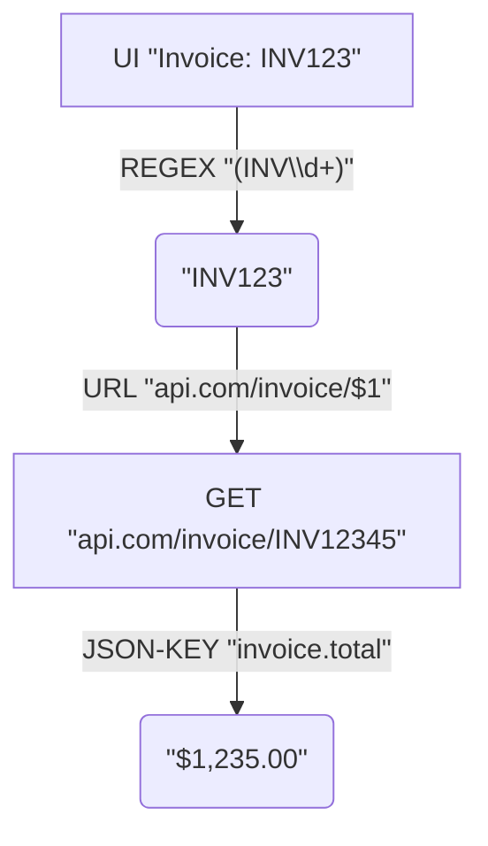

# MatchKit

<p align="center">
  
</p>

<p align="center">
  <a href='http://makeapullrequest.com'></a>
  
  
</p>

Windows automation tool to extract text from applications using UI Automation, process it with regex, optionally call web APIs, and paste results. Includes a console app and a system tray app with global hotkey support.

## Features

- **Text Extraction**: Uses UI Automation to extract text from Windows applications.
- **Regex Matching**: Applies regular expressions to find patterns in extracted text.
- **API Integration**: Calls REST APIs with extracted data; processes JSON responses.
- **JSON Path Extraction**: Extracts specific values from JSON using dot notation.
- **Hotkey Automation**: System tray app with configurable global hotkeys (`-k, --hotkey`).
- **Clipboard Integration**: Pastes results at the cursor position.
- **Debug Mode**: Provides detailed logging for troubleshooting.
- **Persistent Configuration**: Saves and loads automation settings via the registry.

## Core Workflow

MatchKit processes information as follows:



## Target Users

MatchKit helps users automate repetitive text-related tasks on Windows:

- **IT Professionals & Power Users**: Automate data extraction from legacy apps, generate reports, integrate systems without APIs.
- **Data Entry Specialists**: Accelerate data input by automatically fetching and pasting information.
- **Software Testers**: Create simple UI testing or data validation scripts.
- **Help Desk & Support Staff**: Quickly look up information using hotkeys.
- **Anyone with repetitive copy-paste tasks**: Saves time by automating text copying, transformation, and pasting.

## Components

### MatchKit.Core

Shared library with core functionality:

- `TextAutomationService`: UI Automation for window finding and text extraction.
- `HttpUtilityService`: HTTP client for API calls.
- `AutomationOrchestrator`: Manages workflow for console and tray apps.
- `ConfigurationService`: Handles saving and loading settings from the registry.

### MatchKit (Console Application)

Command-line tool for direct automation:

- Lists available windows.
- Extracts text using regex.
- Calls APIs and processes responses.
- Ideal for testing configurations.

### MatchKit.Tray (System Tray Application)

System tray application for hotkey-triggered automation:

- Global hotkey registration.
- Pastes results via clipboard.
- Provides user notifications.
- Uses persistent configuration.

## Installation

### Prerequisites

- Windows 7 or later.
- .NET Framework 4.8.1.
- Visual Studio 2019 or later (to build from source).

### Binary Installation

1. Download the latest release from the [Releases](https://github.com/fluxinc/MatchKit/releases) page.
2. Extract the archive.
3. Run executables from your chosen location.
   Use installers (if available in release) for system-wide configuration and startup.

## Getting Started: First Automation

Automate extracting a number from Notepad:

**1. Prepare Target Application:**
   Open Notepad. Type: "Order ID: 12345".

**2. Find Window Identifier:**
   To find window titles or process names, run:

   ```bash
   MatchKit.exe --list-windows
   ```

   Look for "Notepad" or "notepad.exe".

**3. Test with Console App (`MatchKit.exe`):**
   To extract "12345" (one or more digits `\d+`) after "Order ID: ", use the regex `Order ID: (\d+)`. `()` creates a capture group; `$1` refers to the number.

   ```bash
   # Extract any 4-digit number (using process name)
   MatchKit.exe -w "notepad.exe" -r "\d{4}"

   # Extract number after "Order ID: "
   MatchKit.exe -w "notepad.exe" -r "Order ID: (\d+)"
   ```

   MatchKit prints the extracted number if successful.

**4. (Optional) Add API Call and JSON Extraction:**
   For API workflows:

   ```bash
   # Example: Look up the extracted ID (replace with a real API)
   MatchKit.exe -w "notepad.exe" -r "Order ID: (\d+)" -u "http://api.example.com/orders/$1" -j "orderDetails.status"
   ```

   Use `-d` (debug) to view the full API response for troubleshooting JSON path extraction.

**5. (Optional) Save Configuration (`MatchKit.exe`):**
   Save settings for `MatchKit.Tray.exe` or as defaults for `MatchKit.exe` (requires admin privileges):

   ```bash
   # Save the configuration, including a hotkey for the tray app
   MatchKit.exe -w "notepad.exe" -r "Order ID: (\d+)" -u "http://api.example.com/orders/$1" -j "orderDetails.status" -k "Ctrl+Shift+N" --save
   ```

   Settings are stored in the registry.

**6. Deploy to System Tray (`MatchKit.Tray.exe`):**

- If configuration (including hotkey) was saved with `MatchKit.exe --save`:

     ```bash
     MatchKit.Tray.exe
     ```

     The tray app loads saved settings and registers the hotkey.
- To run with a temporary configuration or override saved settings:

     ```bash
     MatchKit.Tray.exe -w "notepad.exe" -r "Order ID: (\d+)" -k "Ctrl+Alt+N"
     ```

   Pressing the hotkey (e.g., Ctrl+Shift+N) triggers automation and pastes the result.

**7. Configure Interactively:**
   Manage saved configurations (requires admin privileges):

- `MatchKit.exe --config`: Command-line configuration.
- `MatchKit.Tray.exe --config`: GUI configuration editor.

## Usage

### Command-Line Options

MatchKit uses command-line options. Settings can be saved to the registry for `MatchKit.Tray.exe`.

**Operational Options (`MatchKit.exe`, `MatchKit.Tray.exe`):**
Define a single automation task or a hotkey's action.

- `-w, --window`: Window identifier (process name, exact title, or regex title pattern). **[Required]**
- `-r, --regex`: Regex pattern to find and extract text. Use `()` for capture groups. `$1` is used for API calls or output. **[Required]**
- `-u, --url`: (Optional) URL template. Extracted text (usually `$1`) is inserted. Example: `http://api.example.com/items/$1`. An HTTP GET request is made.
- `-j, --json-key`: (Optional) If `--url` is used and API returns JSON, specifies the dot notation path to the desired value. Example: `data.name`.
- `-d, --debug`: (Optional) Enables debug logging (window text, full API response).

**Configuration Options (Persistent Settings):**
Manage configurations in the Windows Registry. Requires admin privileges.

- `-c, --config`: Interactive configuration.
  - `MatchKit.exe --config`: Command-line guide to set and save defaults.
  - `MatchKit.Tray.exe --config`: GUI to manage and save parameters.
- `-s, --save` (`MatchKit.exe` only): Saves operational arguments (`-w, -r, -u, -j, -k`) from the command as the new default configuration.

**`MatchKit.exe` (Console) Specifics:**

- `-l, --list-windows`: Lists open, visible windows (titles, process names) to help find identifiers for `-w`.

**`MatchKit.Tray.exe` (System Tray) Specifics:**

- `-k, --hotkey`: Global hotkey for automation (e.g., "Ctrl+Shift+R").
  - If launched with this option, it overrides saved configuration for the session.
  - If launched without arguments, loads configuration (including hotkey) from registry.
  - If no arguments and no saved config, tray app may need configuration.

### Console Application (`MatchKit.exe`)

For direct automation and testing configurations.

**List Windows:**

```bash
MatchKit.exe --list-windows
```

**Basic Text Extraction:**

```bash
# Extract 4-digit number from Notepad
MatchKit.exe -w "notepad" -r "\d{4}"

# Extract using process name and capture group
MatchKit.exe -w "notepad.exe" -r "Invoice: (\w+)"
```

Prints extracted value to console.

**With API Integration:**

```bash
MatchKit.exe -w "MyApp" -r "ID: (\d+)" -u "http://api.example.com/items/$1" -j "data.name"
```

### System Tray Application (`MatchKit.Tray.exe`)

Runs in background for hotkey-triggered automation.

**Basic Usage:**

```bash
# Hotkey automation (overrides saved config for this session)
MatchKit.Tray.exe -w "notepad" -r "\d{4}" -k "Ctrl+R"

# With API and JSON (overrides saved config for this session)
MatchKit.Tray.exe -w "MyApp" -r "ID: (\d+)" -u "http://api.example.com/items/$1" -j "data.name" -k "Ctrl+Shift+D"

# Run with saved configuration (recommended)
# Ensure config (including hotkey) was set via --config or MatchKit.exe --save
MatchKit.Tray.exe
```

**Supported Hotkey Formats:**

- Modifier + key: `Ctrl+R`, `Alt+F1`, `Shift+A`
- Multiple modifiers: `Ctrl+Shift+R`, `Ctrl+Alt+D`
- Function keys: `F1`-`F12`
- Number keys: `0`-`9`
- Letter keys: `A`-`Z`

## Real-World Examples

### Extract and Look Up Invoice Numbers

```bash
# Test with console
MatchKit.exe -w "InvoiceApp" -r "INV-(\d{6})" -u "http://erp.company.com/api/invoices/$1" -j "invoice.total"

# For Tray (after saving above with MatchKit.exe --save -k "Ctrl+I")
MatchKit.Tray.exe
# Or, run directly (overrides/without saved config):
# MatchKit.Tray.exe -w "InvoiceApp" -r "INV-(\d{6})" -u "http://erp.company.com/api/invoices/$1" -j "invoice.total" -k "Ctrl+I"
```

### Medical Report Integration (DXA/DEXA)

Regex `(A\d{8,}[A-Z]{2})` for accession numbers (A, 8+ digits, 2 uppercase letters).

```bash
# Config to save with MatchKit.exe --save -k "Ctrl+T":
# -w "PowerScribe" -r "(A\d{8,}[A-Z]{2})" -u "http://10.200.63.74:3000/en/show/exam/$1/template/5/format/text.json" -j "body"

# Then run Tray app:
MatchKit.Tray.exe
# Or, test/run directly:
# MatchKit.Tray.exe -w "PowerScribe" -r "(A\d{8,}[A-Z]{2})" -u "http://10.200.63.74:3000/en/show/exam/$1/template/5/format/text.json" -j "body" -k "Ctrl+T"
```

### Customer ID Lookup

```bash
# Save with MatchKit.exe --save -k "Alt+C":
# -w "CRM" -r "CUST(\d+)" -u "https://api.crm.com/customers/$1" -j "customer.email"

# Then run Tray app:
MatchKit.Tray.exe
# Or, test/run directly:
MatchKit.Tray.exe -w "CRM" -r "CUST(\d+)" -u "https://api.crm.com/customers/$1" -j "customer.email" -k "Alt+C"
```

## Testing Your Configuration

1. **Test with Console First**:

    ```bash
    MatchKit.exe -w "YourApp" -r "YourRegex" -u "YourAPI" -j "json.path" -d
    ```

2. **Verify Output**: Check console results. Use `-d` for debug output.
3. **(Optional) Save for Tray App**: If console command works, use `MatchKit.exe` with same operational arguments plus `--save` and `-k "Hotkey"`:

    ```bash
    MatchKit.exe -w "YourApp" -r "YourRegex" -u "YourAPI" -j "json.path" -k "Ctrl+R" --save
    ```

4. **Deploy to Tray**: Run `MatchKit.Tray.exe` (ideally without arguments to load saved config). Press hotkey.

    ```bash
    MatchKit.Tray.exe
    ```

    To test tray app with direct parameters (without saving):

    ```bash
    MatchKit.Tray.exe -w "YourApp" -r "YourRegex" -u "YourAPI" -j "json.path" -k "Ctrl+R"
    ```

## JSON Path Syntax

The `-j` parameter supports standard JSON path notation:

- Property: `name`
- Nested: `data.customer.name`
- Array index: `items[0]`
- Array property: `items[0].name`

## Troubleshooting

- **Window Not Found**: Use `MatchKit.exe --list-windows`. Try exact process name (e.g., `notepad.exe`). Use regex for dynamic titles.
- **Regex Not Matching**: Test on [regex101.com](https://regex101.com). Use `-d` to see extracted text. `()` creates capture groups; `$1` uses the first.
- **API Issues**: Verify URL accessibility. Check authentication. Use `-d` for full response. Test API with tools like Postman.
- **Hotkey Conflicts**: Choose a unique hotkey (`-k, --hotkey`). Try different combinations. Some apps may intercept hotkeys.
- **Clipboard/Paste Issues**: Ensure target app has focus. Check for paste restrictions.

## Building from Source

```bash
git clone https://github.com/fluxinc/MatchKit.git
cd MatchKit
msbuild MatchKit.sln /p:Configuration=Release
```

Or build individual projects (`MatchKit.Core.csproj`, `MatchKit.csproj`, `MatchKit.Tray.csproj`).

## Architecture

```
MatchKit.sln
├── MatchKit.Core/           # Shared library (automation logic)
├── MatchKit/                # Console application
└── MatchKit.Tray/           # System tray application
```

## Contributing

Contributions are welcome. Submit a Pull Request. For major changes, open an issue first.

### Development Guidelines

1. Maintain project separation (Core, Console, Tray).
2. Add debug logging for new features.
3. Ensure user-friendly error messages.
4. Test with both console and tray apps.
5. Update documentation for new features.

## License

MIT License - see [LICENSE](LICENSE) file.

## Acknowledgments

- Windows UI Automation
- .NET Framework 4.8.1
- System.CommandLine
- Newtonsoft.Json

## Support

For issues or questions, use [GitHub Issues](https://github.com/fluxinc/MatchKit/issues).
