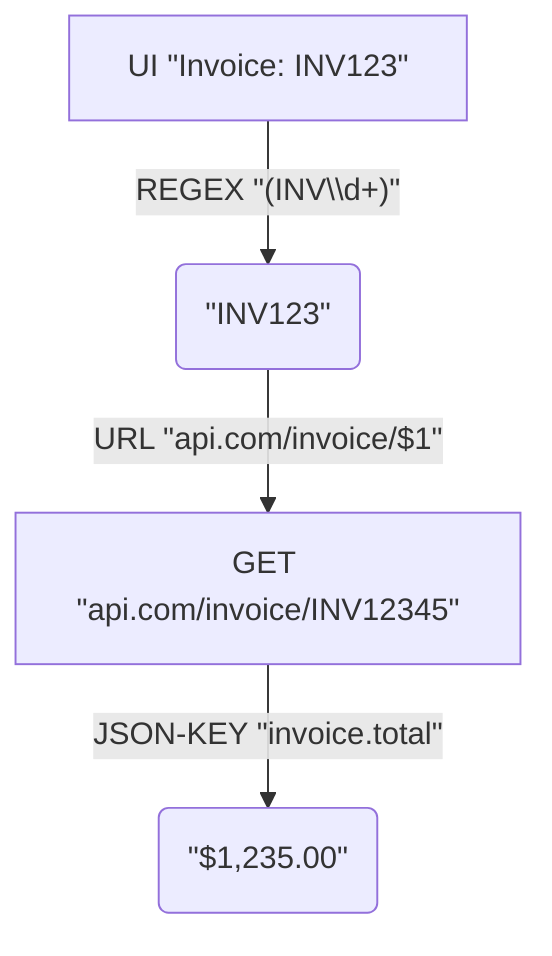

# MatchKit

<p align="center">
  
</p>

A powerful Windows automation tool that extracts text from any application using UI Automation, processes it with regex patterns, optionally calls web APIs, and can paste results back into applications. Available as both a console application and a system tray application with global hotkey support.

## Features

- **Text Extraction**: Extract text from any Windows application using UI Automation
- **Regex Matching**: Apply regular expressions to find specific patterns in extracted text
- **API Integration**: Call REST APIs with extracted data and process JSON responses
- **JSON Path Extraction**: Extract specific values from JSON responses using dot notation
- **Hotkey Automation**: System tray app with configurable global hotkeys (`-k, --hotkey`)
- **Clipboard Integration**: Automatically paste results at cursor position
- **Debug Mode**: Detailed logging for troubleshooting
- **Persistent Configuration**: Save and load automation settings

## Core Workflow Visualized

Here's a simplified visual representation of how MatchKit processes information:



## Who is MatchKit For?

MatchKit is designed for a variety of users who need to automate repetitive tasks involving text extraction and processing on Windows:

- **IT Professionals & Power Users**: Automate data extraction from legacy applications, generate reports, or integrate systems that don't have APIs.
- **Data Entry Specialists**: Speed up data input by automatically fetching and pasting information from one application to another.
- **Software Testers**: Create simple automation scripts for UI testing or data validation.
- **Help Desk & Support Staff**: Quickly look up information (e.g., customer details, error codes) from internal tools using hotkeys.
- **Anyone performing repetitive copy-paste tasks**: If you frequently copy text from one window, optionally transform it, and paste it elsewhere, MatchKit can save you significant time and effort.

## Components

### MatchKit.Core

Shared library providing core functionality:

- `TextAutomationService`: UI Automation for window finding and text extraction
- `HttpUtilityService`: HTTP client for API calls
- `AutomationOrchestrator`: Workflow orchestration used by both console and tray apps

### MatchKit (Console Application)

Command-line tool for direct automation tasks:

- List available windows
- Extract text using regex patterns
- Call APIs and process responses
- Perfect for testing configurations

### MatchKit.Tray (System Tray Application)

Windows system tray application for hotkey-triggered automation:

- Global hotkey registration
- Clipboard-based pasting
- User-friendly notifications
- Persistent configuration

## Installation

### Prerequisites

- Windows OS (Windows 7 or later)
- .NET Framework 4.8.1
- Visual Studio 2019 or later (for building from source)

### Binary Installation

Download the latest release from the [Releases](https://github.com/fluxinc/MatchKit/releases) page. Extract the archive and run the executables from your desired location. For system-wide configuration and startup options, consider using the provided installers (if available in the release).

## Getting Started: Your First Automation

Let's walk through creating a simple automation: extracting a number from Notepad and displaying it.

**1. Identify Your Target Application and Text:**
   Open Notepad and type some text, for example: "Order ID: 12345"

**2. Find the Window Identifier:**
   If you're unsure of the window title or process name, use `MatchKit.exe` to list active windows:

   ```bash
   MatchKit.exe --list-windows
   ```

   Look for "Notepad" or "notepad.exe".

**3. Test with the Console Application (`MatchKit.exe`):**
   This is the most crucial step for building and testing your automation.
   Let's say you want to extract the "12345". The regex for one or more digits is `\d+`. If you specifically want it after "Order ID: ", the regex could be `Order ID: (\d+)`. The parentheses `()` create a capture group, so `$1` will refer to the number itself.

   ```bash
   # Extract any 4-digit number from Notepad (using process name)
   MatchKit.exe -w "notepad.exe" -r "\d{4}"

   # Extract the number after "Order ID: "
   MatchKit.exe -w "notepad.exe" -r "Order ID: (\d+)"
   ```

   If it works, MatchKit will print the extracted number.

**4. (Optional) Add API Call and JSON Extraction:**
   If your workflow involves an API:

   ```bash
   # Example: Look up the extracted ID (replace with a real API)
   MatchKit.exe -w "notepad.exe" -r "Order ID: (\d+)" -u "http://api.example.com/orders/$1" -j "orderDetails.status"
   ```

   Use the `-d` (debug) flag to see the full API response if you're having trouble with JSON path extraction.

**5. (Optional) Save Your Configuration (using `MatchKit.exe`):**
   Once you're happy with the console command, you can save these settings to be used by `MatchKit.Tray.exe` or as defaults for `MatchKit.exe`. This requires admin privileges.

   ```bash
   # Save the configuration, including a hotkey for the tray app
   MatchKit.exe -w "notepad.exe" -r "Order ID: (\d+)" -u "http://api.example.com/orders/$1" -j "orderDetails.status" -k "Ctrl+Shift+N" --save
   ```

   Now, these settings are stored in the registry.

**6. Deploy to the System Tray (`MatchKit.Tray.exe`):**

- If you've saved the configuration using `MatchKit.exe --save` (which included a hotkey), you can simply run `MatchKit.Tray.exe` without any arguments. It will load the saved settings and register the hotkey.

     ```bash
     MatchKit.Tray.exe
     ```

- Alternatively, if you want to run `MatchKit.Tray.exe` with a specific, temporary configuration without saving it, or to override saved settings:

     ```bash
     MatchKit.Tray.exe -w "notepad.exe" -r "Order ID: (\d+)" -k "Ctrl+Alt+N"
     ```

   Now, pressing your defined hotkey (e.g., Ctrl+Shift+N or Ctrl+Alt+N) while Notepad is the active application (or any application if your window target is broad) should trigger the automation and paste the result.

**7. Configure Interactively:**
   You can manage saved configurations using:

- `MatchKit.exe --config`: For command-line based configuration.
- `MatchKit.Tray.exe --config`: For a GUI-based configuration editor.
   Both require admin privileges to save changes.

## Usage

### Command-Line Options Overview

MatchKit's behavior is controlled by command-line options. Settings can be saved to the registry for persistent configurations, especially for `MatchKit.Tray.exe`.

**Common Operational Options (for `MatchKit.exe` and `MatchKit.Tray.exe`):**
These options define the core automation task for a single execution or for a hotkey's action if not loading from a saved configuration.

- `-w, --window`: Window identifier. This can be a process name (e.g., `notepad.exe`), an exact window title (e.g., "Untitled - Notepad"), or a regex pattern to match a window title (e.g., "Invoice .*"). **[Required]**
- `-r, --regex`: The regular expression pattern used to find and extract text from the targeted window. Use parentheses `()` to define capture groups. The content of the first capture group (`$1`) is typically used for API calls or as the final output. **[Required]**
- `-u, --url`: (Optional) A URL template. If provided, the extracted text (usually from the first regex capture group, `$1`) will be inserted into this URL, and an HTTP GET request will be made. For example: `http://api.example.com/items/$1`.
- `-j, --json-key`: (Optional) If the `--url` option is used and the API returns a JSON response, this specifies the path (using dot notation) to the desired value within the JSON object. For example: `data.name` or `results[0].id`.
- `-d, --debug`: (Optional) Enable debug logging. This will print more detailed information about the automation process, including all text extracted from the window and the full API response, which is very helpful for troubleshooting.

**Configuration Options (Managing Persistent Settings):**
These options are used to save, load, and manage automation configurations in the Windows Registry. This allows `MatchKit.Tray.exe` to remember settings and hotkeys across sessions. Running these typically requires administrator privileges.

- `-c, --config`: Interactive configuration mode.
  - When used with `MatchKit.exe`: Starts a command-line interface to guide you through setting and saving default parameters (window, regex, URL, JSON key, hotkey) to the registry.
  - When used with `MatchKit.Tray.exe`: Opens a graphical user interface (GUI) window that allows you to manage and save these parameters to the registry.
- `-s, --save` (`MatchKit.exe` only): Saves the operational command-line arguments (`-w`, `-r`, `-u`, `-j`, `-k`) provided in the same command as the new default configuration in the registry. This is useful for scripting setups or pre-configuring MatchKit.

**`MatchKit.exe` (Console Application) Specific Options:**

- `-l, --list-windows`: Lists all currently open, visible windows with their titles and process names. This helps you find the correct identifier for the `-w, --window` option.

**`MatchKit.Tray.exe` (System Tray Application) Specific Options:**

- `-k, --hotkey`: Specifies the global hotkey combination that will trigger the automation (e.g., "Ctrl+Shift+R", "Alt+F1").
  - If `MatchKit.Tray.exe` is launched with this option, it will use the provided parameters for this session, overriding any saved configuration.
  - If `MatchKit.Tray.exe` is launched *without* this option (and other operational arguments), it will attempt to load the configuration (including the hotkey) from the registry (previously saved using `--config` or `MatchKit.exe --save`).
  - If no arguments are provided and no configuration is saved in the registry, the tray application may not have a default hotkey and will need to be configured.

### Console Application (MatchKit.exe)

Command-line tool for direct automation tasks, ideal for testing configurations.

#### List Available Windows

```bash
MatchKit.exe --list-windows
```

#### Basic Text Extraction

```bash
# Extract a 4-digit number from Notepad
MatchKit.exe -w "notepad" -r "\d{4}"

# Extract using process name and capture group
MatchKit.exe -w "notepad.exe" -r "Invoice: (\w+)"
```

If a value is extracted, it will be printed to the console.

#### With API Integration

```bash
# Extract text, call API, and display response field
MatchKit.exe -w "MyApp" -r "ID: (\d+)" -u "http://api.example.com/items/$1" -j "data.name"
```

### System Tray Application (MatchKit.Tray.exe)

Windows system tray application for hotkey-triggered automation. It runs in the background and waits for the configured hotkey.

#### Basic Usage

```bash
# Simple hotkey automation (overrides saved config for this session)
MatchKit.Tray.exe -w "notepad" -r "\d{4}" -k "Ctrl+R"

# With API call and JSON extraction (overrides saved config for this session)
MatchKit.Tray.exe -w "MyApp" -r "ID: (\d+)" -u "http://api.example.com/items/$1" -j "data.name" -k "Ctrl+Shift+D"

# Run with saved configuration from registry (recommended for general use)
# Ensure configuration (including hotkey) was previously set via --config or MatchKit.exe --save
MatchKit.Tray.exe
```

#### Supported Hotkey Formats

- Single key + modifier: `Ctrl+R`, `Alt+F1`, `Shift+A`
- Multiple modifiers: `Ctrl+Shift+R`, `Ctrl+Alt+D`
- Function keys: `F1` through `F12`
- Number keys: `0` through `9`
- Letter keys: `A` through `Z`

## Real-World Examples

### Extract and Look Up Invoice Numbers

```bash
# Console version for testing
MatchKit.exe -w "InvoiceApp" -r "INV-(\d{6})" -u "http://erp.company.com/api/invoices/$1" -j "invoice.total"

# Tray version with hotkey (after saving the above config with MatchKit.exe --save -k "Ctrl+I")
MatchKit.Tray.exe
# Or, run directly overriding/without saved config:
# MatchKit.Tray.exe -w "InvoiceApp" -r "INV-(\d{6})" -u "http://erp.company.com/api/invoices/$1" -j "invoice.total" -k "Ctrl+I"
```

### Medical Report Integration (DXA/DEXA)

This example shows a more complex regex and specific API endpoint.

```bash
# Configuration to be saved using MatchKit.exe --save -k "Ctrl+T":
# -w "PowerScribe" -r "(A\d{8,}[A-Z]{2})" -u "http://10.200.63.74:3000/en/show/exam/$1/template/5/format/text.json" -j "body"

# Then run Tray app:
MatchKit.Tray.exe

# Or, to test/run directly:
MatchKit.Tray.exe -w "PowerScribe" -r "(A\d{8,}[A-Z]{2})" -u "http://10.200.63.74:3000/en/show/exam/$1/template/5/format/text.json" -j "body" -k "Ctrl+T"
```

The regex `(A\d{8,}[A-Z]{2})` looks for an accession number starting with 'A', followed by 8 or more digits, and ending with two uppercase letters.

### Customer ID Lookup

```bash
# Save this config using MatchKit.exe --save -k "Alt+C":
# -w "CRM" -r "CUST(\d+)" -u "https://api.crm.com/customers/$1" -j "customer.email"

# Then run Tray app:
MatchKit.Tray.exe

# Or, to test/run directly:
MatchKit.Tray.exe -w "CRM" -r "CUST(\d+)" -u "https://api.crm.com/customers/$1" -j "customer.email" -k "Alt+C"
```

## Testing Your Configuration

1. **Test with Console First**: Always test your regex and API calls with the console app:

   ```bash
   MatchKit.exe -w "YourApp" -r "YourRegex" -u "YourAPI" -j "json.path" -d
   ```

2. **Verify Output**: Ensure you're getting the expected results in the console. Use `-d` for debug output.

3. **(Optional) Save for Tray App**: If the console command works perfectly, use `MatchKit.exe` with the same operational arguments plus `--save` and your desired `-k "Hotkey"` to save it to the registry.

   ```bash
   MatchKit.exe -w "YourApp" -r "YourRegex" -u "YourAPI" -j "json.path" -k "Ctrl+R" --save
   ```

4. **Deploy to Tray**: Run `MatchKit.Tray.exe` (ideally without arguments, to load the saved configuration). Press your hotkey to test.

   ```bash
   MatchKit.Tray.exe
   ```

   If you need to test the tray app with parameters directly (without saving), use:

   ```bash
   MatchKit.Tray.exe -w "YourApp" -r "YourRegex" -u "YourAPI" -j "json.path" -k "Ctrl+R"
   ```

## JSON Path Syntax

The `-j` parameter supports standard JSON path notation:

- Simple property: `name`
- Nested property: `data.customer.name`
- Array index: `items[0]`
- Array property: `items[0].name`
- Deep nesting: `response.data.records[0].details.value`

## Troubleshooting

### Window Not Found

- Use `MatchKit.exe --list-windows` to see available windows
- Try using the exact process name (e.g., `notepad.exe`)
- For windows with changing titles, use a regex pattern

### Regex Not Matching

- Test your regex at [regex101.com](https://regex101.com)
- Use debug mode (`-d`) to see extracted text
- Remember that `()` creates capture groups - `$1` uses the first group

### API Issues

- Verify the URL is accessible
- Check if authentication is required
- Use debug mode to see the full response
- Test the API separately with tools like Postman

### Hotkey Conflicts

- Choose a hotkey not used by other applications (the `-k` or `--hotkey` option).
- Try different combinations if one doesn't work.
- Some applications may intercept certain hotkeys

### Clipboard/Paste Issues

- Ensure the target application has focus
- Some applications may have paste restrictions
- Try increasing the delay in code if needed

## Building from Source

```bash
# Clone the repository
git clone https://github.com/fluxinc/MatchKit.git
cd MatchKit

# Build the solution
msbuild MatchKit.sln /p:Configuration=Release

# Or build individual projects
msbuild MatchKit.Core\MatchKit.Core.csproj
msbuild MatchKit\MatchKit.csproj
msbuild MatchKit.Tray\MatchKit.Tray.csproj
```

## Architecture

```
MatchKit.sln
├── MatchKit.Core/           # Shared library for core automation logic
├── MatchKit/                # Console application project
└── MatchKit.Tray/           # System tray application project
```

## Contributing

Contributions are welcome! Please feel free to submit a Pull Request. For major changes, please open an issue first to discuss what you would like to change.

### Development Guidelines

1. Maintain the separation between Core, Console, and Tray projects
2. Add debug logging for new features
3. Ensure error messages are user-friendly
4. Test with both console and tray applications
5. Update documentation for new features

## License

This project is licensed under the MIT License - see the [LICENSE](LICENSE) file for details.

## Acknowledgments

- Uses Windows UI Automation for text extraction
- Built with .NET Framework 4.8.1
- System.CommandLine for argument parsing
- Newtonsoft.Json for JSON processing

## Support

For issues, questions, or contributions, please use the [GitHub Issues](https://github.com/mostlydev/MatchKit/issues) page.
